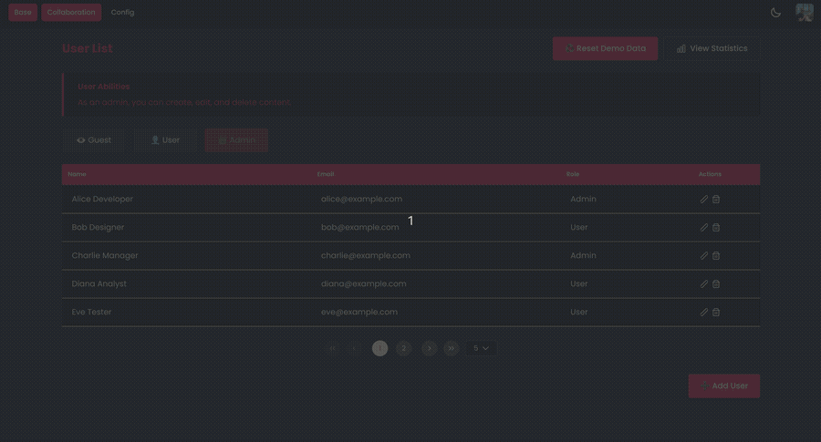

# Angular Betting App – Skills Showcase

> A proof-of-concept sports betting application built to demonstrate Angular expertise. Every architectural decision is deliberate: NgRx Signal Store composition, live polling, and full accessibility on dynamic odds data.

## Why I Built It

Most Angular demos pick one state management paradigm and stop there. This one runs NgRx Signal Store and classic NgRx Effects side-by-side in the same application, and explains exactly why: the Signal Store owns local UI state, while a classic `timer`-driven Effect handles polling, a cross-cutting concern that has no clean home inside the signal graph. The domain (sports betting) is intentionally simple. The point is the engineering discipline beneath it: `OnPush` everywhere, reusable custom SignalStore features, `withComponentInputBinding` to keep components clean, and full ARIA semantics on live-updating odds data.

---

## Demo

---

## Tech Stack

| Layer | Technology | Decision |
|---|---|---|
| Framework | Angular 17+ (standalone components) | No NgModules, fully standalone component architecture |
| Primary state | NgRx Signal Store | Signals-first, declarative, composable via custom features |
| Secondary state | NgRx Classic (Store / Effects / Selectors) | Retained for `timer`-based polling, a cross-cutting concern that belongs outside the signal graph |
| Reactivity bridge | Angular Signals, RxJS, `rxMethod` | Bridges RxJS streams into the signal store without leaking Observables into components |
| Styling | LESS with design tokens via variables | Variables-based theming, no utility-class sprawl |
| Mock Server | Koa.js (Node) | Zero-framework overhead for a pure API mock |

---

## Getting Started

\`\`\`bash
npm install
npm run dev
\`\`\`

Frontend: `http://localhost:4200` | Mock API: `http://localhost:3000`

---

## What This Demonstrates

| Skill | Where |
|---|---|
| NgRx Signal Store with custom reusable feature | `src/core/state/events.store.ts`, `features/withEventsCallState.ts` |
| Classic NgRx slice (actions/reducer/effects/selectors) running alongside Signal Store | `src/core/state/classic/` |
| `rxMethod` — RxJS-to-signals bridge | `withMethods()` in the store |
| `withComponentInputBinding` — route params as typed `@Input()` signals | `app.config.ts`, `home.component.ts` |
| `ChangeDetectionStrategy.OnPush` on every component | All components |
| Lazy-loaded routes via `loadComponent` | `app.routes.ts` |
| Full ARIA semantics on live-updating odds data | `event-card.component.html` |
| Standalone components — zero NgModules | All components |
| `inject()` function — no constructor injection | All services and stores |
| Custom SignalStore feature composition | `withEventsCallState` |
| Feature-based folder structure (`core/`, `features/`, `shared/`) | `src/app/` |
